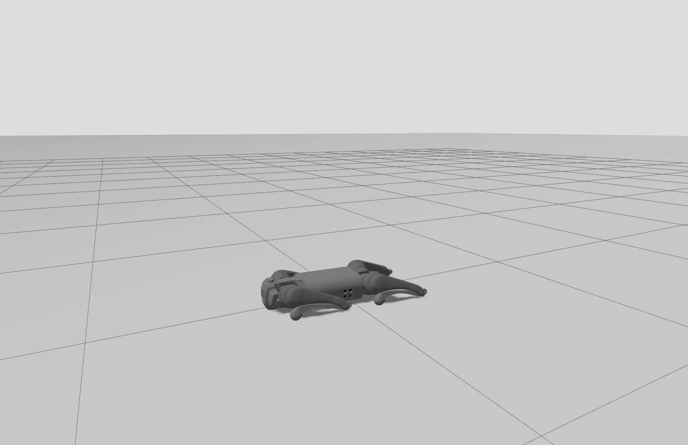
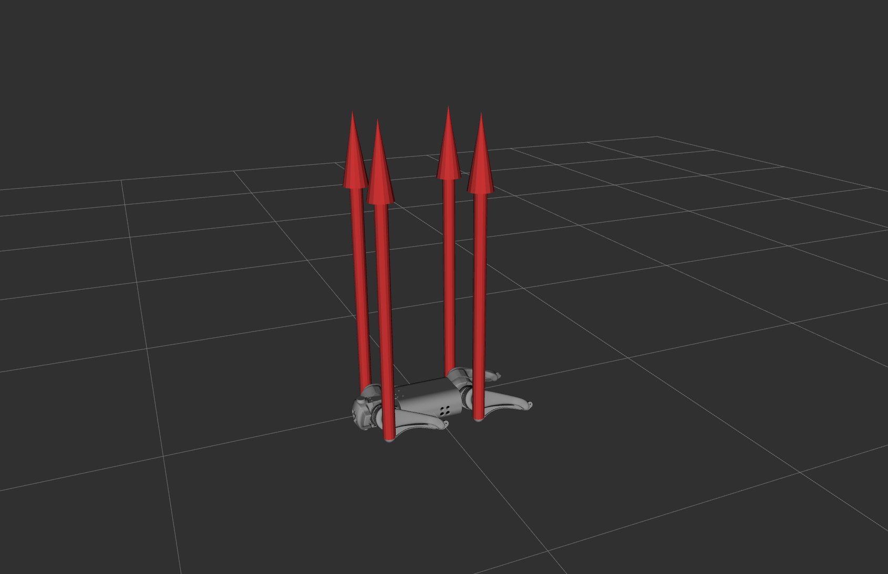

# unitree_go1_gazebo

This repository contains a Gazebo simulation setup for Unitree GO1. The simulated robot provides a similar interface to
the real robot, allowing users to easily develop programs with the simulation first and then transfer to the real robot.

* The setup referred to the configurations in
  the [ros_gz_project_template](https://github.com/gazebosim/ros_gz_project_template) package.
* The GO1 model is based on go1_description package from
  the [unitree_ros](https://github.com/unitreerobotics/unitree_ros) package.
* The LegJointController is based on the LegPdController from
  the [quadruped_ros2_control](https://github.com/legubiao/quadruped_ros2_control) package.




This repository also serves as a reference for creating a Gazebo simulation for any robot. You can find
documentation of the simulation setup process in [SETUP.md](docs/SETUP.md).

## Supported platform

The following platforms are supported and tested:

* Ubuntu 24.04
* ROS Jazzy
* Gazebo Harmonic

## Build the package

* Install ROS and Gazebo Harmonic

You may refer to the [official ROS installation guide](https://docs.ros.org/en/jazzy/Installation.html) for the
installation of ROS Jazzy.

Then you can install the bundled Gazebo Harmonic with the following command:

```bash
sudo apt-get install ros-${ROS_DISTRO}-ros-gz
```

* Clone repositories

At the time of writing, the `gz_ros2_control` package doesn't include the support for the force-torque sensors. You can
use the forked version of the package that includes the support:

```bash
cd <directory_of_the_colcon_workspace>/src
git clone -b jazzy https://github.com/rxdu/gz_ros2_control.git
git clone https://github.com/rxdu/unitree_go1_gazebo.git
```

* Install the ROS dependencies

Since the robot dog has a lot of joints (3 per leg, 12 in total), the `ros2_control` framework is used for the control
interface

```bash
sudo apt install ros-jazzy-ros2-control ros-jazzy-ros2-controllers
```

Additional dependencies can be installed with rosdep:

```bash
cd <directory_of_the_colcon_workspace>
rosdep install --from-paths src -y --ignore-src
```

* Build the workspace

```bash
colcon build --event-handlers console_direct+ --symlink-install --cmake-args -DCMAKE_EXPORT_COMPILE_COMMANDS=ON -G Ninja
```

Note that the "-DCMAKE_EXPORT_COMPILE_COMMANDS=ON" option is used to generate the compile_commands.json file for the
Code Editor/IDE (e.g. Visual Studio Code, Clion).
