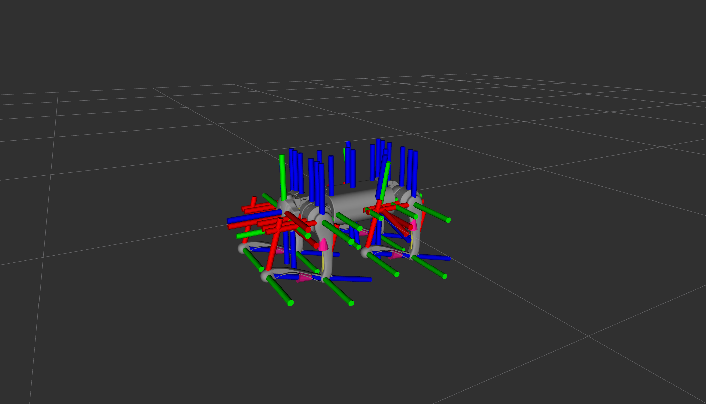

# Gazebo Simulation Setup

## 1. Setup the robot model

### Robot joints and links

You first need to define the robot joints and links in an urdf or xacro file. You can use the GO2 model as a reference
and the robot-part is mainly defined in the following files (located in xacro folder:

* **robot.xacro**: main model file that includes all other xacro files
* **go1/const.xacro**: robot dimensions, mass, inertial etc.
* **go1/materials.xacro**: colors and textures
* **go1/leg.xacro**: leg links and joints
* **go1/ultrasonic.xacro**: ultrasonic sensor links and joints
* **go1/depth_camera.xacro**: depth camera links and joints

You can verify the robot joint setup with `joint_state_publisher_gui` and `robot_state_publisher`:

```bash
ros2 launch unitree_go1_gazebo description.launch.py
```

You should see the robot joints and robot model displayed in the RViz window.



### Gazebo configuration

Besides the information of the robot itself, you also need to define the robot's sensors, controllers, and plugins for
the simulation. Again, you can use the GO1 setup as a reference and the simulation setup is mainly defined in:

* **go1/gazebo.xacro**: additional physical properties for the links
* **go1/transmission.xacro**: transmission setup for the robot joints
* **go1/ros2_control.xacro**: ros2_control setup for the robot joints and sensors

